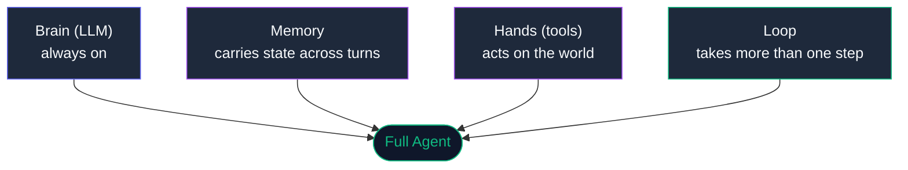

<div align="center">

# Agent Anatomy — What Is an Agent, Really?

**One agent. Four organs. Switch each one off and watch it break.**

`brain (LLM)` + `memory` + `hands (tools)` + `loop` = agent

[](https://nodejs.org)
[]()
[]()
[](LICENSE)

</div>

---

## The one-liner

An **agent** is not a model. It's a model (the **brain**) wired to three more things: **memory** to carry state across turns, **hands** (tools) to act on the world, and a **loop** to take more than one step.

Take any one away and it collapses into something simpler — usually a plain chatbot.

This repo lets you *feel* that. The same agent runs with organs added one at a time, then with each one deliberately removed. The failure modes are not described — they are demonstrated.

---

## The four organs



---

## See each organ added

```bash
node parts/1-the-brain/demo.js    # talks, but forgets and can't act
node parts/2-the-memory/demo.js   # now it remembers your name
node parts/3-the-hands/demo.js    # reaches for a tool... but freezes (no loop yet)
node parts/4-the-loop/demo.js     # full agent — finally completes the tool call
```

The same 3-turn script runs each time ("Remember my name is Alex" / "What is my name?" / "What is 12 × 9?"). The only variable is which organs are active.

---

## Break it on purpose (ablations)

```bash
node ablations/no-memory.js   # forgets your name across turns   → continuity dies
node ablations/no-tools.js    # can only talk, cannot calculate  → agency dies
node ablations/no-loop.js     # freezes mid-tool-call            → it's a chatbot
```

Each ablation maps one organ to one capability. Watching it break is the fastest way to understand what the organ does.

| Remove | What breaks | What you have left |
|--------|-------------|-------------------|
| Memory | Continuity | A stateless chatbot |
| Tools | Agency | A text predictor |
| Loop | Completion | A single-turn responder |
| Brain | Everything | Nothing |

---

## Interactive version

Open [`web/index.html`](web/index.html): four toggle switches (brain is always-on and disabled, the other three flip). Flip one off and the predicted behavior updates live before you run a command.

---

## Read more

- [`GLOSSARY.md`](GLOSSARY.md) — chatbot vs. assistant vs. agent vs. workflow vs. swarm, settled with one test per term
- [`ablations/README.md`](ablations/README.md) — what each organ proves, and why ablation is the right teaching method

---

## Zero setup

Node 18+, no dependencies, no API keys. Runs fully offline in mock mode by default.

```bash
git clone https://github.com/shubham0086/Agent-Anatomy
cd Agent-Anatomy
node parts/1-the-brain/demo.js
```

Use a real model (Ollama or any OpenAI-compatible endpoint) — see [`SETUP.md`](SETUP.md).

---

## Where this fits

This is the **zoom-in** on a single agent. For the bigger picture — how a plain script becomes a workflow, a team, and a swarm — see the companion repo **[AI-systems-evolution](https://github.com/shubham0086/AI-systems-evolution)** first (rung 03 is the agent this repo dissects). For production-grade versions of memory, tools, and routing see **[agentkernel](https://github.com/shubham0086/agentkernel)** and **[agentic-systems](https://github.com/shubham0086/agentic-systems)**.

```
AI-systems-evolution   ← start here (the six-rung autonomy ladder)
        |
        └─► Agent-Anatomy        ← you are here (rung 03 opened up)
                |
                ├─► agentic-patterns   the architecture theory
                ├─► agentic-systems    five production-grade systems
                └─► agentkernel       the infra engines underneath
```

---

<div align="center">

Built by [Shubham Prajapati](https://github.com/shubham0086) ·
[Portfolio](https://shubham0086.github.io/MyPortfolio.github.io/)
· MIT (code) · CC BY 4.0 (content)

</div>
