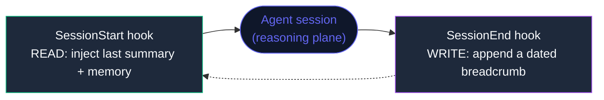

# Part 5 — The Harness (the control plane around the agent)

> The four organs (`brain`, `memory`, `hands`, `loop`) make an agent *act*.
> The **harness** is what makes it *reliable*. It is not an organ. It is the
> skeleton and nervous system the agent runs inside.

---

## The distinction most people miss

A production agent system has **two planes**, and they have opposite properties:

| | Reasoning plane (the agent) | Control plane (the harness) |
|---|---|---|
| What it is | The model loop: brain + memory + hands + loop | The deterministic scaffolding around it |
| Behaviour | **Probabilistic** — may vary run to run | **Deterministic** — same input, same result |
| Costs tokens | Yes | No |
| Can it "think"? | Yes | No |
| Good at | Open-ended reasoning, language, tool choice | **Guarantees**: this *always* happens |

The single most useful idea in building reliable agents:

> **Put guarantees in the deterministic plane. Never ask a probabilistic model to
> remember to do something that must always happen.**

If a file must always be written, a secret must never be committed, or context must
always be restored — that is a *control plane* job. The moment you rely on the model
to "remember," you have built something that works in the demo and fails in week three.

---

## What lives in the harness

- **Lifecycle hooks** — code that fires on events (session start/end, before/after a
  tool runs, before context is compacted). Deterministic, free, cannot "forget."
- **Permissions / guardrails** — what the agent is allowed to touch.
- **Context management** — what gets loaded in, what gets summarized, what persists.
- **Schedulers** — recurring or cron-driven runs, independent of the model being "awake."

---

## Three automation primitives — and when each is correct

A worked example: "keep my work context unbroken between sessions."

| Primitive | Triggered by | Runs | Use when |
|-----------|-------------|------|----------|
| **Hook** | A lifecycle event | A deterministic script | Something must ALWAYS happen, reliably, for free |
| **Interval loop** | A timer | The model, re-run | You need the model to keep checking while you watch (billed) |
| **Scheduled agent** | A cron schedule | The model, in the cloud | Recurring work that must run even when your machine is off |

Picking the wrong one is a common tell. "Summarize my session every day" is *not* a
hook (a hook can't think). "Always create today's log file" is *not* a scheduled
model run (that's wasteful and unreliable). Match the property to the primitive.

---

## A concrete pattern: the self-healing context loop

Two hooks, opposite ends of a session, close a loop:



- `SessionEnd` → deterministically write a dated file. A record **always** exists,
  even if the model never wrote a nice summary.
- `SessionStart` → deterministically read the latest record back into context. The
  next session **always** knows where the last one left off.

Neither step asks the model to remember. That is the whole point. The model does the
thinking; the harness guarantees the continuity.

> Sketch of a `SessionEnd` hook (deterministic, no model call):
> ```
> on SessionEnd(payload):
>     date = today()
>     file = f"sessions/session-{date}.md"
>     if not exists(file): create(file, template)
>     append(file, f"- ended {now()} | session {payload.id}")
> ```

---

## Why this matters (the ablation, harness edition)

Same spirit as the rest of this repo — remove the piece, watch what breaks:

| Remove from the harness | What breaks |
|-------------------------|-------------|
| Lifecycle hooks | Nothing is guaranteed; reliability depends on the model "remembering" |
| Permissions | The agent can touch anything — no blast-radius control |
| Context restore | Every session starts cold; continuity dies |
| Scheduling | Nothing runs unless a human is sitting there |

An agent with great organs but no harness is a great demo. An agent with a real
harness is a system you can leave running.

---

## From concept to a full spec

This part is the *idea* of the harness. For the complete, copy-paste version — every guarantee a
production multi-agent system needs (reality files, durable memory, recovery supervisor, cost
enforcer, the security contract), distilled from real engines and made platform-agnostic — see:

> **[`production-multi-agent-template.md`](production-multi-agent-template.md)** — the harness, fully
> specified. Includes *why* raw LLMs drift and forget, and how an IDE-integrated coding agent fixes it.

---

## Read more

- [`../../README.md`](../../README.md) — the four organs this part sits beside
- [`../4-the-loop/README.md`](../4-the-loop/README.md) — the loop is the agent's;
  the harness is the loop's container
